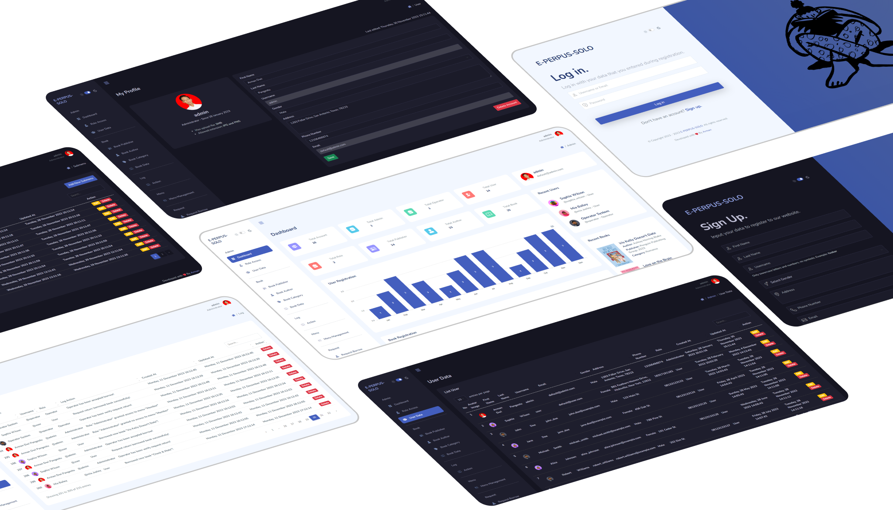
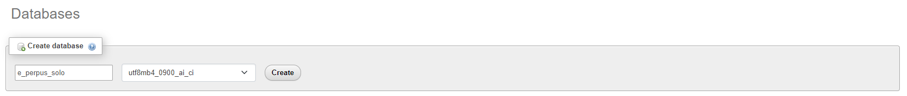
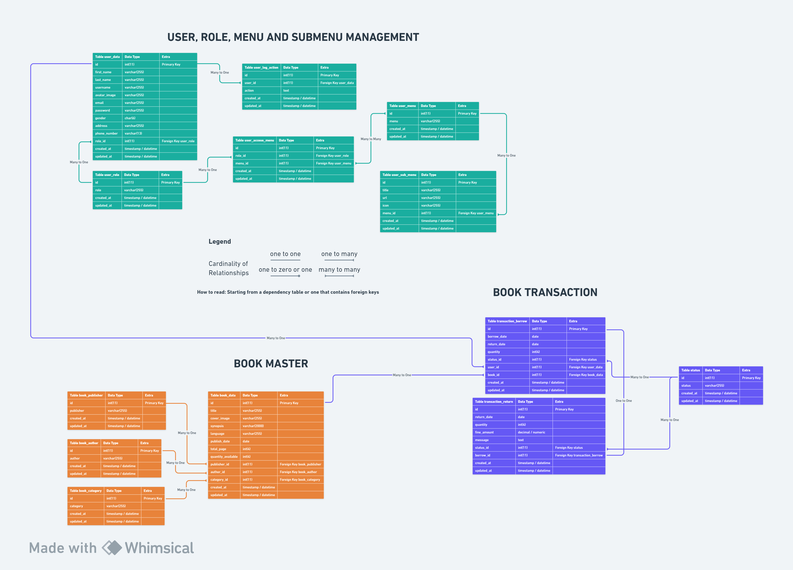

<h1 align="center">Codeigniter 3.1.13 - E-PERPUS-SOLO</h1>
<p align="center">An open source Library Management System application with framework CodeIgniter version 3.1.13</p>



# Table of Contents

- [Tech Stack](#tech-stack)
- [Dependency](#dependency)
- [How to Install](#how-to-install)
  - [Clone or Download this repository](#clone-or-download-this-repository)
  - [Create file `.env.development`](#create-file-envdevelopment)
  - [Setup Database](#setup-database)
    - [GUI](#gui)
    - [CLI](#cli)
- [List Default Account Login](#list-default-account-login)
- [ERD (Entity Relationship Diagram)](#erd-entity-relationship-diagram)

## Tech Stack

This boilerplate build with some tech stack, such as:

> **NOTE**:
>
> - `Codeigniter` for backend framework
>
> - `Mazer` for UI template from frontend framework `Bootstrap`

- [Codeigniter Version 3.1.13](https://codeigniter.com/userguide3/installation/downloads.html)
- [Mazer Version 2.3.0](https://github.com/zuramai/mazer/releases/tag/v2.3.0)
- [Bootstrap Version 5.3.2](https://getbootstrap.com/)
- [jQuery Version 3.7.1](https://code.jquery.com/jquery-3.7.1.min.js)
- [Simple Datatables](https://github.com/fiduswriter/simple-datatables)
- [Sweetalert Version 11.7.32](https://github.com/sweetalert2/sweetalert2/releases/tag/v11.7.32)
- [ApexCharts Version 3.44.0](https://github.com/apexcharts/apexcharts.js/releases/tag/v3.44.0)
- [Fontawesome Version 5.15.4](https://fontawesome.com/v5/download)
- [Dripicons Version 2.0.0](https://github.com/amitjakhu/dripicons/releases/tag/2)
- [PHP Dotenv for Codeigniter](https://github.com/agungjk/phpdotenv-for-codeigniter)

## Dependency

> **NOTE**:
>
> - For PHP, MySQL and Apache you can install with bundle software like `XAMPP`, `MAMP`, `LAMP` or `Laragon`
>
> - `Git` for cloning or downloading this repository

- [PHP 5 ~ 8.0](https://www.php.net/releases/8.0/en.php)
- [MySQL 5.1+](https://downloads.mysql.com/archives/community/)
- [Apache](https://httpd.apache.org/)
- [Git](https://git-scm.com/downloads)

## How to Install

### Clone or Download this repository

> **NOTE**:
>
> Save this clone on PATH where webserver can load such as `xampp/htdocs`, `/var/www`, `/srv/http` or `laragon/www`

- Clone this repository using SSH

```shell
git clone git@github.com:armandwipangestu/e-perpus-solo.git
```

- Clone this repository using HTTPS

```shell
git clone https://github.com/armandwipangestu/e-perpus-solo.git
```

### Create file `.env.development`

```sh
cd e-perpus-solo
```

```sh
cp .env.example .env.development
```

> **NOTE**:
>
> Change the `.env.development` fields with your configuration (such as database name, etc)
>
> Default configuration is:
>
> ```
> # Database Connection
> DB_HOSTNAME=localhost
> DB_USERNAME=root
> DB_PASSWORD=
> DB_NAME=e_perpus_solo
> DB_CONNECTION=mysqli
>
> # BASE PATH
> # use localhost
> BASE_URL=/e-perpus-solo
> # use pretty url from laragon, like `e-perpus-solo.test`
> # BASE_URL=
>
> # APP NAME
> APP_NAME=E-PERPUS-SOLO
> ```

### Setup Database

#### GUI

- Create a new Database with GUI

  

- Import `e-perpus-solo/database/e_perpus_solo.sql` to the database using phpmyadmin or GUI

  

#### CLI

- Create a new Database with CLI

```sql
CREATE DATABASE e_perpus_solo;
```

- Import schema to database using CLI

```shell
mysql -u root -p e_perpus_solo < database/e_perpus_solo.sql
```

or if you use powershell terminal, you can run this command:

```pwsh
Get-Content 'database\e_perpus_solo.sql' | mysql -u root -p e_perpus_solo
```

## List Default Account Login

| Email                | Username      | Password      | Role          |
| -------------------- | ------------- | ------------- | ------------- |
| default@admin.com    | administrator | 123qweasdzxc  | Administrator |
| default@operator.com | operator      | 123qweasdzxc  | Operator      |
| default@user.com     | user          | 123qweasdzxcz | User          |

## ERD (Entity Relationship Diagram)

You can view this ERD on this link [whimsical.com/erd-sbd-e-perpus-solo-SmsYrg1YNrizCCrQvuZjQf](https://whimsical.com/erd-sbd-e-perpus-solo-SmsYrg1YNrizCCrQvuZjQf)


